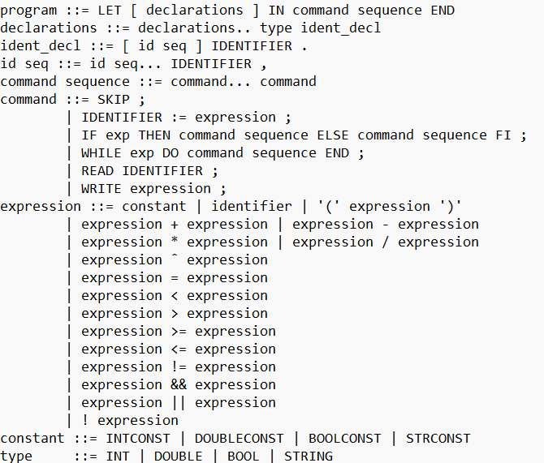

# ucg_project

# Project: Implementation of Lexer, Parser, and AST for the Pmf0 Programming Language

## Project Description
This project consists of three parts, each representing a phase in developing a compiler for the Pmf0 programming language. The goals are:
 1. Implementation of the lexer 
 2. Implementation of the parser using Bison 
 3. Creation of the Abstract Syntax Tree (AST) 

## Project Structure

#### main.cc:
Main function that runs the lexer and parser.
Initialization of necessary structures and function calls for analysis.

#### tokens.h:
Declarations of functions and types for lexical analysis.

#### pmf0.l:
Implementation of the lexer using Flex.
Rules for recognizing tokens.
Mechanisms for reporting errors with line and column.

#### pmf0.y:
Implementation of the parser using Bison.
Grammar rules for the Pmf0 language.
Actions associated with rules for creating the AST.
Resolving shift/reduce and reduce/reduce conflicts.

#### location.h:
Helper functions for managing token positions (yylloc/yyltype).

#### input.txt:
File for testing with various input data.


## Requirements
- Flex (for generating the lexer)
- Bison (for generating the parser)
- GCC (or any other C++ compiler)

### Pmf0 Programming Language Description

The Pmf0 programming language is designed with specific lexical and syntactic rules. Below is a detailed description of its key characteristics:

- **Keywords**: Reserved words that cannot be used as identifiers. They are case-sensitive (e.g., `if`, `else`, `while`).
- **Identifiers**: A sequence of letters, digits, and underscores starting with a letter. Case-sensitive and up to 31 characters long.
- **Whitespace**: Spaces, tabs, and newlines that separate tokens but are otherwise ignored.
- **Boolean Constants**: `true` and `false`.
- **Integer Constants**: Decimal (e.g., `123`) or hexadecimal (e.g., `0x1A`).
- **Double Constants**: Digits followed by a dot and optional exponent (e.g., `3.14`, `2.0E+10`).
- **String Constants**: A sequence of characters enclosed in double quotes.
- **Operators and Punctuation**: Includes `+`, `-`, `*`, `/`, `%`, `\`, `<`, `<=`, `>`, `>=`, `=`, `==`, `!=`, `&&`, `||`, `!`, `;`, `.` `(`, `)`.
- **Comments**: Single-line (`//`) and multi-line (`/* ... */`).

#### Grammar Rules

The grammar for the Pmf0 language is defined in Backus-Naur Form (BNF). Below is a detailed explanation of the grammar rules, operator precedence, and associativity:



##### Operator Precedence and Associativity

Operators are listed from highest to lowest precedence. Operators with the same precedence are evaluated based on their associativity.

1. **Highest Precedence**
   - Unary: `!`, `-` (unary minus, logical not) - **Right-associative**
2. **Multiplicative**
   - `*`, `/`, `%` (multiplication, division, modulo) - **Left-associative**
3. **Additive**
   - `+`, `-` (addition, subtraction) - **Left-associative**
4. **Relational**
   - `<`, `<=`, `>`, `>=` (comparison) - **Non-associative**
5. **Equality**
   - `==`, `!=` (equality) - **Non-associative**
6. **Logical AND**
   - `&&` - **Left-associative**
7. **Logical OR**
   - `||` - **Left-associative**
8. **Lowest Precedence**
   - Assignment: `=` - **Right-associative**

##### Control Structures

- **If-Else**: `if (condition) statement else statement`
  - The `else` is paired with the closest preceding `if`.
  - The condition must be of type `bool`.
- **While Loop**: `while (condition) statement`
  - The condition must be of type `bool`.
- **For Loop**: `for (initialization; condition; increment) statement`
  - The condition must be of type `bool`.
- **Break Statement**: Can only be used within `while` or `for` loops.
- **Return Statement**: `return expression;`
  - The expression must be compatible with the function's return type.


## Installation
 Install the required tools:

 ```sh
sudo apt-get install flex bison gcc
```

## Building and Running

### Generating the Lexer with Flex
To generate the lexer from the Flex file (`pmf0.l`):
```sh
flex pmf0.l
```
This command will create the lex.yy.c file, which contains the lexer.

### Compiling the Lexer
To compile the lexer:
```sh
gcc -o scanner lex.yy.c -lfl
```

### Generating the Parser with Bison
To generate the parser from the Bison file (pmf0.y):

```sh
bison -d pmf0.y
```
This command will create two files: pmf0.tab.c (the parser implementation) and pmf0.tab.h (the parser header).

### Compiling the Parser
To compile the parser and the lexer together:
```sh
gcc pmf0.tab.c lex.yy.c -o parser -lfl
```

### Running the Program
To run the program with an input file:
```sh
./parser < input.txt
```

